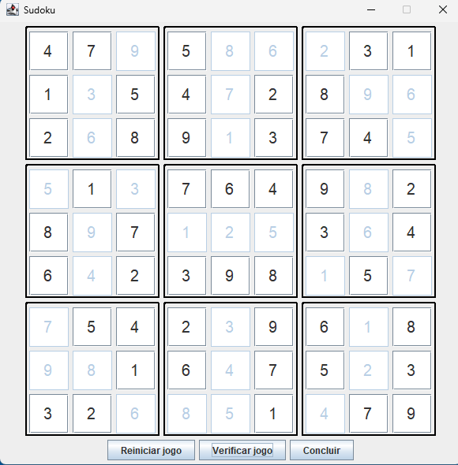

# Jogo de Sudoku

Este projeto é um jogo de Sudoku desenvolvido em Java com interface gráfica, oferecendo uma experiência interativa e visualmente agradável para os usuários. O jogo permite que o jogador preencha uma grade 9x9 com números de 1 a 9, seguindo as regras clássicas do Sudoku: cada número deve aparecer uma vez por linha, coluna e subgrade 3x3.

# Tecnologias utilizadas

 - Java Swing (javax.swing.JButton) – Biblioteca para criar elementos gráficos como janelas, painéis e botões.

 - 
AWT Event Handling (java.awt.event.ActionListener) – Mecanismo para capturar e tratar eventos de interação do usuário, como cliques de botão.

## ⚙️ Funcionalidades

O jogo de Sudoku possui uma interface gráfica simples e intuitiva com três botões principais:

- 🔄 **Reiniciar**  
  Ao ser clicado, pergunta ao jogador se realmente deseja reiniciar o jogo. Caso confirmado, o tabuleiro é resetado.

- ✅ **Verificar Jogo**  
  Analisa o tabuleiro atual e informa ao jogador se existe algum erro ou inconsistência na solução.

- 🏁 **Concluir**  
  Permite finalizar o jogo.
    - Se a solução estiver correta → o jogo é concluído com sucesso.
    - Se houver inconsistências → uma mensagem avisa que há erros e o jogador precisa corrigir antes de tentar novamente.

# Progama funcioando
